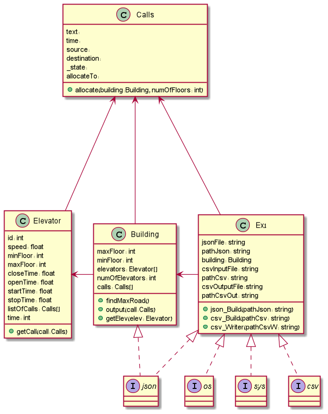
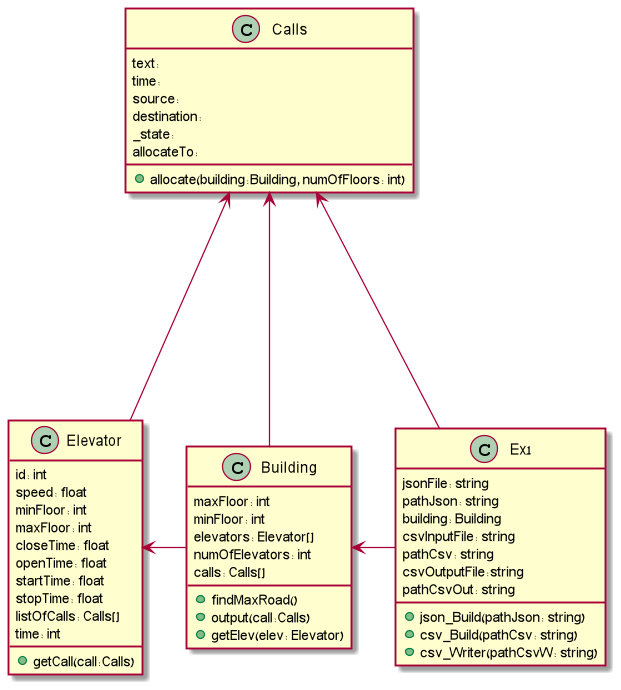

# Ex1 – OOP
 Offline Algorithm – Python
 Prof. Boaz Ben Moshe 
 Alon Barak - 213487598
 Omer Adar - 325022952

### Literature review:
Projects we thought might be helpful for this assignment:
1.	Efficient Elevator Algorithm - Tennessee University. https://trace.tennessee.edu/cgi/viewcontent.cgi?article=3380&context=utk_chanhonoproj
2.	Smart Elevator – Geeks For Geeks. 
https://www.geeksforgeeks.org/smart-elevator-pro-geek-cup/
3.	Intellevator – IEEE Access.
https://ieeexplore.ieee.org/stamp/stamp.jsp?arnumber=9003300

### The difference between Online algorithms and Offline algorithms:
Most of the time, offline algorithms send the entire data as an input to the algorithm and the method can use the data to optimize and solve the solution better. 
On the other hand, online algorithms sends the data piece by piece in some serial order without having the entire data from the beginning.
As a result of not having the whole data from the beginning, online algorithms might make decisions that later on might seem not so smart or optimal. Offline algorithms have the option to make the best decisions according to the given data which make it easier for offline algorithms to reach a better and more efficient than online algorithms.

### Describing the problem we facing:
Given 2 data files, one represents the building and contains within it an array of elevators with different parameters, and the other contains a copy of Calls that the elevators must perform at minimal time.
The output will arrive as the same file as the Calls file but with scheduling received for each call in the file.

### Offline Algorithm for the Elevator problem:
1.	Sort the elevators base on their data (while considering all of their time variables ).
2.	We'll find the call with the maximum length from the given calls (maxRoad).
3.	We'll calculate a range (maxRoad\numOfElevators) to classify a "call completing range" for each elevator (the "best" elevator will get the longest range, the "second best" will get the second longest range and so on).
4.	For each call that got in we'll calculate:
 4.1	The length of the call.
 4.2	Considering the given length we'll give the call the number of elevator that will take care of completing it.
 4.3	We'll return the ID of the chosen elevator.
5.	Repeat the process for each call that left.

|Calls/Building|B1     |B2        |B3      |B4      |B5      |
|--------------|--------|----------|--------|--------|--------|
| Calls a      |112.92  | 50.64    | 28.71  |20.9    |15.66   |
| Calls b      |        |          | 454.34 |184.43  |68.88   |
| Calls c      |        |          | 451.22 |182.21  |61.18   |
| Calls d      |        |          | 432.83 |177.45  |64.04   |

<<<<<<< HEAD

=======

>>>>>>> 5df1d610ca43945ff5fafc27cb2b2cc25f55bd6c
